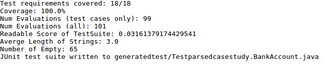
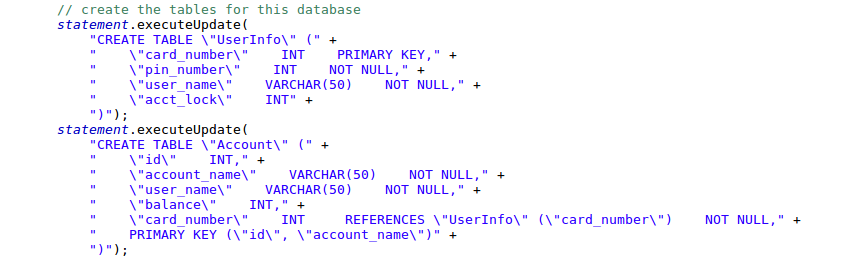
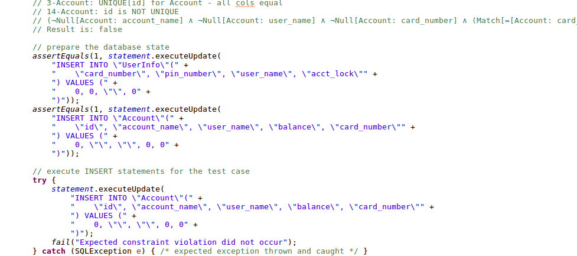
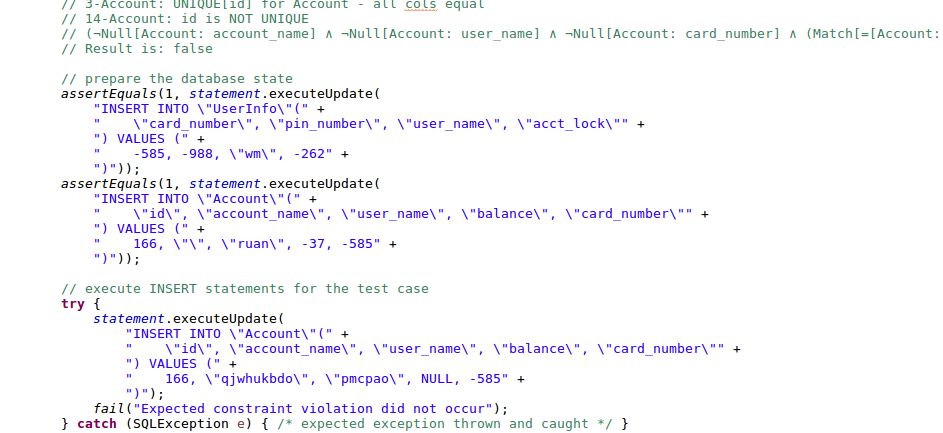
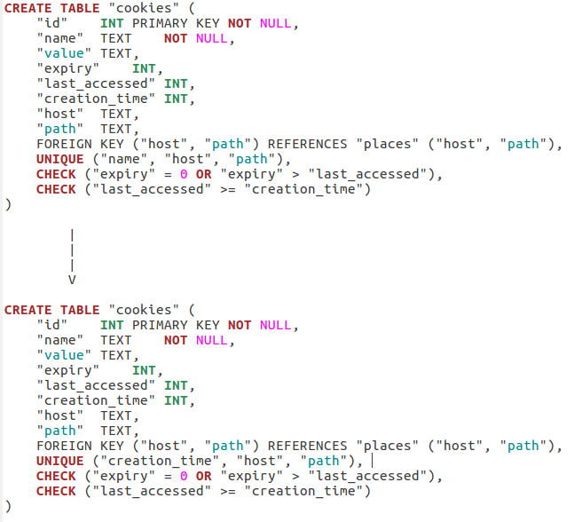
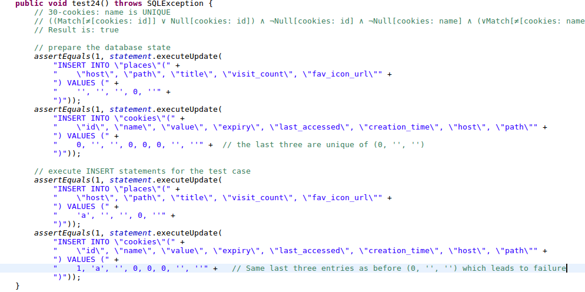

```{r setup, include=FALSE}
library(ggplot2)
library(dplyr)
knitr::opts_chunk$set(echo = TRUE)
knitr::opts_chunk$set(fig.pos = 'H')
mutationanalysistiming <- directedRandomR::collect_mutationanalysistime()
mutanttiming <- directedRandomR::collect_mutanttiming()
#mutationanalysistiming <- mutationanalysistiming %>% filter(casestudy != "iTrust")
#mutanttiming <- mutanttiming %>% filter(schema != "iTrust")
effect_size_thresholding <- directedRandomR::analyse_vargha_delaney_effect_size_thresholding(mutationanalysistiming)
wilcox_ranking <- directedRandomR::analyse_wilcox_rank_sum_test(mutationanalysistiming)
#directedRandomR::plot_heatmap_mutanttiming(mutanttiming)
#directedRandomR::plot_heatmap_mutanttiming_allinone(mutanttiming)
#directedRandomR::plot_heatmap_mutanttiming_allinone_dbms(mutanttiming)
```

## Directed Random Mechanism

Directed Random works as same as random technique however it is guided by predicates that are checked then used to fix the random generated solution. For instance, each INSERT statement must comply to a test requirement that have one or many predicates such as NOT NULL for a specific column, first directed random generate random insert statement then proceed to fixing the insert statement based on a given predicate. If a column is NULL but the predicate require a NOT NULL for this specific column, directed random will fix the insert statement to have NOT NULL. However, Directed random usually fixes one predicate at a time, so if there is many violated predicates in one insert statement it will only fix one then iterate to the next evaluation to fix the other remaining predicates. This means that each evaluation does not fix all predicates or search for optimal solution, however each evaluation checks if the statement is complying with the test requirement.


### Directed Random Algorithm

```{r, eval=FALSE}
p <= predicate
n <= insert statement
CHECK method:
  IF n Comply with p THEN
    return true
  ELSE
    return false
END METHOD

FIX method:
    GET non-Complied predicate
    GET c <=column for non-complied predicate
    REPEAT:
      generate random value for column
    UNTIL vaule comply with predicate
END METHOD

generate random values for table insert n
result <= CHECK n aganist p

while result == Ture
  FIX n aganist p
  result <= CHECK n aganist p
END WHILE
```

In our experiments we ran two test data generators AVM and Directed Random (DR), from our experiment we are looking at the performance of the two techniques in regard of test generation timing and mutation score. This will help us to determine which of the techniques are better in those both factors. Looking at test generation timing will determine which of the two are faster in generating test cases. On the other hand we will look at mutation analysis of the two techniques to determine the strength and the capability of the test suite generated to detect faults.

### Experiment Set Up

Our experiment set-up was to run each technique 30 times for each case study using one combined coverage criteria "ClauseAICC+AUCC+ANCC". Each run has different random seed to see the difference of results.
<!--
### Case Studies

The following table has the case studies that are been used in our experiment:

```{r case_studies, echo=FALSE}
#case_studies <- read.csv("CaseStudies.csv", check.names=FALSE)
#knitr::kable(case_studies)
#library(pander)
#pander(case_studies, style = "multiline")
#pander(case_studies, split.cells = 30, split.table = Inf)
```
-->
# Results
## Test generation Timing

When comparing test generation time we look at how efficient the technique are in regard of the time it takes to generate test suites (ALL AVM and DR has 100% coverage). Figure 1 shows the average test generation timing for each technique for each DBMS, for all runs and schemas. Just By looking at the graph it shows that Directed Random is much faster/efficient compared to AVM in generating test cases nearly 1 second faster for different SQL database engine. ??? Why Postgres takes longer for each AVM and DR compared to other engines ? different semantics or larger engine ?


```{r timing, echo=FALSE, fig.cap='Avrages of Test generation timing - in seconds. Group By data generator and DBMS, then average test generation timing and then when ploting divide by 1000 to convert to seconds'}
a <- mutationanalysistiming %>% group_by(datagenerator, dbms) %>% summarise(testgenerationtime = mean(testgenerationtime)) %>% filter(datagenerator != "random") %>% ggplot(aes(datagenerator, (testgenerationtime / 1000))) + geom_bar(stat = "identity") + facet_grid(. ~ dbms)  + labs(y = "Average Test Generation Time (In Seconds) For All runs and schems", x = "Technique") + theme(axis.text.x = element_text(angle = 45, hjust = 1))
ggsave(a, file="plots/figure1.pdf", width = 6, height = 6)
a
```

To look in more details we split test generation timing analysis for each case study. In Figure 2, I review average test generation timing for each techinque for each schema split by DBMSs and for all runs. We can see that Directed Random still winning for each schema. By looking at all of the results in Figure 2 we can see that DR is better than all AVM even by fractions of seconds.

```{r timingForSchemas, echo=FALSE, fig.cap='Avrages of Test generation timing for each schema- in seconds. Group by data generator, DBMS and case sties, average test generation timing, then divide by 1000 to convert to second.'}
a <- mutationanalysistiming %>% group_by(datagenerator, dbms, casestudy) %>% filter(datagenerator != "random") %>% summarise(testgenerationtime = mean(testgenerationtime)) %>% ggplot(aes(casestudy, (testgenerationtime / 1000))) + geom_bar(stat = "identity", aes(fill = datagenerator), position = "dodge") + facet_grid(dbms ~ .)  + theme(axis.text.x = element_text(angle = 90, hjust = 1)) + labs(y = "Average Test Generation Time (In Seconds) All Runs", x = "Case Study") + theme(legend.position="top") + scale_fill_discrete(name="Technique", breaks=c("directedRandom", "avsDefaults", "avs"), labels=c("DR", "AVM-Default", "AVM"))
ggsave(a, file="plots/figure2.pdf", width = 8, height = 8)
a
```

In Figure 3, I show the spread of values of test generation times in regard of DBMS and technique using a box plot, for all runs and schemas. In this plot we sum all result for each run and spread the values in the box plot, this will help to evaluate the spread of runs for all schema and for each technique split by database engine. As shown in the plot that DR is takes less time compared to AVM in generating test.

```{r TestGenTimeBoxPlotDBMS, echo = FALSE, fig.cap='Test generation timing - in seconds. First summing test generation timing for each run then group by data generator and DBMS, then divide test generation timing by 1000 to convert to second.'}
summtion <- directedRandomR::preform_sum_of_samples(mutationanalysistiming)
a <- summtion %>% group_by(datagenerator, dbms) %>% filter(datagenerator != "random") %>% ggplot(aes(datagenerator, (testgenerationtime / 1000))) + geom_boxplot() + facet_grid(. ~ dbms) + theme(axis.text.x = element_text(angle = 45, hjust = 1)) + labs(y = "Test Generation Time (In Seconds)For all Runs and Schemas", x = "Technique")
ggsave(a, file="plots/figure3.pdf", width = 6, height = 6)
a
```

In Figure 4, I show the spread of values for test generation timing for each schema, DBMS and technique, for all runs. This will help us seeing the spread of values for each case study and how long it takes to generate test cases.

```{r TestBoxPlotSchemas, echo = FALSE}
a <- mutationanalysistiming %>% group_by(casestudy, datagenerator, dbms) %>% filter(datagenerator != "random") %>% ggplot(aes(datagenerator, testgenerationtime / 1000)) + geom_boxplot() + facet_grid(dbms ~ casestudy) + theme(strip.text.x = element_text(angle = 90), axis.text.x = element_text(angle = 90, hjust = 1)) + labs(y = "Test Generation Time For all runs per Schema (In Sceconds)")

ggsave(a, file="plots/figure4.pdf", width = 12, height = 12)

```


## Coverages

```{r coverage, echo = FALSE}
a <- mutationanalysistiming %>% filter(datagenerator != "random") %>% ggplot(aes(datagenerator, coverage)) + geom_boxplot() + facet_grid(dbms ~ casestudy) + theme(axis.text.x = element_text(angle = 45, hjust = 1)) + labs(y = "Coverage (%)") + theme(strip.text.x = element_text(angle = 90))

ggsave(a, file="plots/figure22.pdf", width = 12, height = 10)

averages <- directedRandomR::preform_averaging_of_samples(mutationanalysistiming)

a <- averages %>% filter(datagenerator != "random") %>% ggplot(aes(datagenerator, coverage)) + geom_boxplot() + facet_grid(. ~ dbms) + theme(axis.text.x = element_text(angle = 45, hjust = 1)) + labs(y = "Coverage (%)")


ggsave(a, file="plots/figure23.pdf", width = 6, height = 6)


```


## Mutation Scores

In Figure 6, I shows the average mutation score for each technique for each DBMS, for all runs and schemas. Just By looking at the graph it shows that Directed Random is batter when compared to AVM in killing more mutants.

```{r mutationScores, echo=FALSE, fig.cap='Avrages of Mutation Score - in precentage. Grouping by data generator and DBMS, averaging score numerator and denominator for all runs and schemas, then ploting it by divding the numerator by denominator multiplying by 100'}

a <- mutationanalysistiming %>% group_by(datagenerator, dbms) %>% summarise(scorenumerator = mean(scorenumerator), scoredenominator = mean(scoredenominator)) %>% filter(datagenerator != "random") %>% ggplot(aes(datagenerator, ((scorenumerator/scoredenominator) * 100))) + geom_bar(stat = "identity") + facet_grid(. ~ dbms)  + labs(y = "Average Mutation Score (%) For All Runs and Schemas", x = "Technique") 
ggsave(a, file="plots/figure5.pdf", width = 6, height = 6) + theme(axis.text.x = element_text(angle = 45, hjust = 1))

a
```

In Figure 7, I review average mutation score for each techinque for each schema split by DBMSs, for all runs. We can see that Directed Random have a better or similar scores to AVM however not even one schema has less score comparing to AVM. 

```{r mutationScoreSchemas, echo = FALSE, fig.cap='Avrages of Mutation Score for each schema - in precentage. Group by data generator, DBMS and case studies, then averaging score numerator and denominator for all runs per schema (as been grouped by it), then ploting it by divding the numerator by denominator multiplying by 100'}
a <- mutationanalysistiming %>% group_by(datagenerator, dbms, casestudy) %>% filter(datagenerator != "random") %>% summarise(scorenumerator = mean(scorenumerator), scoredenominator = mean(scoredenominator)) %>% ggplot(aes(casestudy, ((scorenumerator/scoredenominator) * 100))) + geom_bar(stat = "identity", aes(fill = datagenerator), position = "dodge") + facet_grid(dbms ~ .)  + theme(axis.text.x = element_text(angle = 45, hjust = 1)) + labs(y = "Average Mutation Score (%) For all Runs", x = "Case Study") + theme(legend.position="top") + scale_fill_discrete(name="Technique", breaks=c("directedRandom", "avsDefaults", "avs"), labels=c("DR", "AVM-Default", "AVM"))
ggsave(a, file="plots/figure6.pdf", width = 8, height = 8)

a
```

In Figure 8, I show the spread of values of mutation score in regard of DBMS and technique using a box plot, for all runs and schemas.

```{r mutationScoreBoxPlotDBMS, echo = FALSE, fig.cap='Box plot for mutation scores for DBMSs and techniques - in precentage. Frist I sum all score numerator and denominator per run per DBMS per data generator, then plottig using group by data generator, DBMS and divding the score numerator by denominator multiplying by 100'}
#averages <- directedRandomR::preform_averaging_of_samples(mutationanalysistiming)
summtion <- directedRandomR::preform_sum_of_samples(mutationanalysistiming)
summtion$mutationscore = ((summtion$scorenumerator/summtion$scoredenominator) * 100)
a <- summtion %>% group_by(datagenerator, dbms) %>% filter(datagenerator != "random") %>% ggplot(aes(datagenerator, mutationscore)) + geom_boxplot() + facet_grid(. ~ dbms) + theme(axis.text.x = element_text(angle = 45, hjust = 1)) + labs(y = "Mutation Score (%) Faor All Runs and Schemas")
ggsave(a, file="plots/figure7.pdf", width = 6, height = 6)

#a <- mutationanalysistiming %>% group_by(casestudy, datagenerator, dbms) %>% filter(datagenerator != "random") %>% ggplot(aes(datagenerator, ((scorenumerator/scoredenominator) * 100))) + geom_boxplot() + facet_grid(. ~ dbms) + theme(axis.text.x = element_text(angle = 45, hjust = 1)) + labs(y = "Mutation Score (%) Faor All Runs and Schemas")

a
```

In Figure 9, I show the spread of values for mutation scores for each schema, DBMS and technique, for all runs.

```{r mutationScoreBoxPlotSchemas, echo = FALSE}
a <- mutationanalysistiming %>% group_by(casestudy, datagenerator, dbms) %>% filter(datagenerator != "random") %>% ggplot(aes(datagenerator, ((scorenumerator/scoredenominator) * 100))) + geom_boxplot() + facet_grid(dbms ~ casestudy) + theme(strip.text.x = element_text(angle = 90), axis.text.x = element_text(angle = 90, hjust = 1)) + labs(y = "Mutation Score (%) All Runs")

ggsave(a, file="plots/figure8.pdf", width = 12, height = 12)

#a
```


## Mutation Scores and Mutation Operators

In Figure 10, I shows the average mutation score for each technique for each DBMS and the mutatan operators, for all runs, schemas and not including Equvilant, Redundant Quasi mutants . Just By looking at the graph it shows that Directed Random is batter when compared to AVM in killing more mutants for two operators the rest shows same percentages.

```{r mutationScoresOperator, echo=FALSE, fig.cap='Averages of mutant scores in regard of Mutant Operators and DBMSs - in precentage. Using mutanttiming file, I group by generator, DBMS and operator (FIXED by removing grouping by schema). Then I only select NORMAL mutants, then calculating the percentage of killed mutant by summing all killed divided by (killed mutant plus alive mutant) multiply by 100.'}

a <- mutanttiming %>% group_by(generator, dbms, operator) %>% filter(generator != "random", type == "NORMAL") %>% summarise(killed_mutants = (length(killed[killed == "true"]) / (length(killed[killed == "false"]) + (length(killed[killed == "true"])))) * 100 ) %>% ggplot(aes(operator, killed_mutants)) + geom_bar(stat = "identity", aes(fill = generator), position = "dodge") + facet_grid(dbms ~ .)  + theme(axis.text.x = element_text(angle = 90, hjust = 1)) + labs(y = "Average Mutation Score (%) for all Runs and Schemas", x = "Mutant Operator") + scale_fill_discrete(name="Technique", breaks=c("directedRandom", "avsDefaults", "avs"), labels=c("DR", "AVM-Default", "AVM"))
ggsave(a, file="plots/figure9.pdf", width = 8, height = 8)

a
```

In Figure 11 I shows a box plot mutation score for each technique for each DBMS and the mutatan operators, this will help us see the spread of values. Just By looking at the graph it shows that Directed Random is batter when compared to AVM in killing more mutants for two operators the rest shows same percentages.

```{r mutationScoresBoxPlotOperator, echo=FALSE}

a <- mutanttiming %>% group_by(generator, dbms, schema, operator) %>% filter(generator != "random", type == "NORMAL") %>% summarise(killed_mutants = (length(killed[killed == "true"]) / (length(killed[killed == "false"]) + (length(killed[killed == "true"])))) * 100 ) %>% ggplot(aes(generator, killed_mutants)) + geom_boxplot() + facet_grid(dbms ~ operator) + theme(strip.text.x = element_text(angle = 90), axis.text.x = element_text(angle = 90, hjust = 1)) + labs(y = "Mutation Score (%)", x = "Mutant Operator") + scale_fill_discrete(name="Technique", breaks=c("directedRandom", "avsDefaults"), labels=c("DR", "AVM"))

ggsave(a, file = "plots/figure10.pdf", width = 12, height = 12)

#a
```


### HeatMap Plot of mutant analysis per technique for each Operator for all schemas

To analysis mutation score in more details we look at the mutant operators that are been killed by both techniques and for each DB engine. In Figure 12 We show that the average percentages of all schemas for each operator that is been killed for each technique. The figure shows that DR always has a higher percentage kill for all operators when compared to AVM in all DB, engines which conclude that DR is much superior to AVM technique.

```{r mutanttiming2, echo=FALSE, fig.cap='Heat Map of mutant scores in regard of Mutant Operators and DBMSs - in percentage. Using mutanttiming file after selecting mutant that has type NORMAL, summing all killed mutant and total mutants (Killed + Alive) grouped by generator, schema, operator and DBMS. Then plotting by grouping the previous calculated data by DBMS, generator and operator, then got the percentage of killed mutants per DBMS, generator and DBMS.'}
#a <- directedRandomR::plot_heatmap_mutanttiming_allinone(mutanttiming)
#library(reshape2)
#newdata <- mutanttiming %>% group_by(schema, generator, operator, dbms) %>% filter(generator != "random" ,type == "NORMAL") %>% summarise(killed_mutants = (length(killed[killed == "true"]) / (length(killed[killed == "false"]) + (length(killed[killed == "true"])))) * 100 )

#data <- melt(newdata, id=c("schema", "generator", "operator", "dbms"))

#heatmapGraph <- data %>% group_by(dbms, generator, operator) %>% summarise(value=mean(value)) %>% ggplot(aes(dbms, generator)) + facet_grid(operator ~ .) + geom_tile(aes(fill = value), colour = "white") + scale_fill_gradient(low = "white", high = "steelblue")+geom_text(aes(label=format(round(value, 2), nsmall = 2)))  + theme(axis.text.x = element_text(angle = 45, hjust = 1)) + theme(strip.text.y = element_text(angle = 360))
newdata <- mutanttiming %>% group_by(schema, generator, operator, dbms) %>% filter(generator != "random" ,type == "NORMAL") %>% summarise(killed_mutants = (length(killed[killed == "true"])), total_mutants = (length(killed[killed == "false"]) + (length(killed[killed == "true"]))))

heatmapGraph <- newdata %>% group_by(dbms, generator, operator) %>% summarise(killed_mutants=mean(killed_mutants), total_mutants = mean(total_mutants)) %>% mutate(value = ((killed_mutants / total_mutants) * 100)) %>% ggplot(aes(dbms, generator)) + facet_grid(operator ~ .) + geom_tile(aes(fill = value), colour = "white") + scale_fill_gradient(low = "white", high = "steelblue")+geom_text(aes(label=format(round(value, 2), nsmall = 2)))  + theme(axis.text.x = element_text(angle = 45, hjust = 1)) + theme(strip.text.y = element_text(angle = 360))

ggsave(heatmapGraph, file = "plots/figure11.pdf", width = 12, height = 12)


#heatmapGraph

```


To look at why PKColumnA has a low kills for AVM, we investigated manually for the reason. We regenerated the test suites with same random seed, with first look we found that AVM has many empty Strings when compared by to DR test suite. Looking at the following figures 13 and 14, showing the summery of empty string within each test suite. I also looked at the PKs especially that uses integers and we found that AVM always try to inset 0 as the only number and for all integer columns except if it is a unique. However, DR randomly generate numbers for integer columns rather than trying to put 0. which I assumed that it might be the reason of AVM having the issue of killing added PKs. However in deeper look and comparing few test suites I found that there is an issue of what is called "composite primary key" which allows for duplication of primary keys.




Composite primary keys usually called compound key, which consist of have two or more unique keys (mostly primary key) in one table. For example if a table has two columns A and B, which they are both primary key, this table can allow the following insert (1,2) (1,3) (1,4) (2,2) but not (1,2) (2,2). In that sense composite primary keys allows duplication of one key if the other key is unique or vice versa. That is why AVM is losing the battle of not detecting primary key addition operator. In the following figures 15, 16 and 17, I show how AVM misses the PKColumnA operator. In those figues I first show the schema that has been mutated by adding "account_name" column in the Account table as PK. In AVM test cases passes which does not catch the mutant because all the PK columns have the same values as the T-sufficient values which will throw a exception as intended. However, in DR test cases violate all the PK columns beucase account name has a different value than T-sufficient values, which will be inserted in the database, and the try-catch will fail as there is no errors. As composite keys can have one column duplicated and the other as unique and vice versa, DR caught the mutant (by luck of having a veriaty of generated variables) and AVM did not becuase of the default values.










Check Constraint Relational Expression Operator Exchange (CCRelationalExpressionOperatorE) which mean changing the relational expressions operators (<, >=, > etc.) within the check constraint. This kind of mutant is hard to kill in some instances however as for DR technique it was slightly higher than AVM, check Figure 11, this is because of DR extracts numbers within the schema and reuse them within the test cases generated. In the other hand, AVM uses default values such as 0 and 1 which in some cases does not test the boundaries of the check constraints.

Unique Column Exchange is another mutant type that exchanges one unique column with another non-unique column. In Figure 12, AVM shows it has slightly higher score than AVM, and If you check Figure 19 it shows that it only happen in BrowserCookies case study. This is because one table has three composite unique keys, which leads the mutation to exchange one of the three columns with a non-unique cloumn. As AVM uses default values, for performance reasons, it tries to insert a row that is similar to the T-suffiecent value, which leads to breaks the unique composite keys, and the test will not pass, meaning it kills the mutant. However in DR had different values generated that are not similar so the test will pass with and the data will be inserted within the database, no issue of breaking the unique composite keys, please view the followng figures 18 and 19 two see the differences of Unique Composite Keys.






## Analyse Wilcox Rank and Effect Size for AVM and Directed Random

To  statistically  analyze  the  the new technique we conducted tests for significance with the nonparametric Wilcoxon rank-sum test, using the sets of 30 execution times obtained with a specific DBMS and all techniques **Hitchhicker Guide Ref**. A p-value that less than $0.05$ is considered significant. To review practical are significance tests we use the nonparametric A12 statistic of Vargha and Delaney **REF** was used to calculate effect sizes. The A12 determine the average probability that one approach beats another, or how superior one technique compared to the other.  We followed the guidelines of Vargha and Delaney in that an effect size is considered to be “large” if the value of A12 is $ < 0:29$ or $> 0.71$, “medium” if A12 is $< 0.36$ or $> 0.64$ and “small” if A12 is $< 0.44$ or $> 0.56$. However, is the values of A12 close to the 0.5 value are viewed as there no effect.

When comparing AVM and Directed Random techniques in regard of time we used Mann-Whitney U-test and the A-hat effect size calculations. As Shown in in the following two tables that there is statistically significat differance between Driected Random and AVM, $p \leq 0.05$. Therefore, we reject the null hypothesis that there is no difference between AVM and Directed Random. As p-value near zero, that directed random is faster than AVM in a statistically significant test. Moreover, the A-12 shows that Directed Random has a large effect size when it comes to test generation timing. Which menas that Directed Random is the winner in regard of test generation timing.


```{r wilcox_ranking, echo=FALSE}
wilcox_ranking2 <- dplyr::select(wilcox_ranking, p.value, dbms, vs)
wilcox_ranking2 <- dplyr::arrange(wilcox_ranking2, vs)
knitr::kable(wilcox_ranking2)
```

<!--Directed Random technique is greater in regard of time in test generation. As the following table shows that size is larger meaning that the effect size of the first technique in much superior when compared to AVM. Thresh-holding meant it investigate the effect size with different levels, to establish sensitivity. Meaning that it is precipitable to humans.

Some Text Description (TODO: Table it write) -->

```{r effect_size_thresholding, eval=FALSE,echo=FALSE}
effect_size_thresholding <- dplyr::select(effect_size_thresholding, size, rank.sum, dbms, threshold)
knitr::kable(effect_size_thresholding)
```


```{r mutanttiming, echo=FALSE}
#a <- directedRandomR::plot_heatmap_mutanttiming_allinone(mutanttiming)
#library(reshape2)
#newdata <- mutanttiming %>% group_by(schema, generator, operator) %>% filter(generator != "random" ,type == "NORMAL") %>% summarise(killed_mutants = (length(killed[killed == "true"]) / (length(killed[killed == "false"]) + (length(killed[killed == "true"])))) * 100 )

#data <- melt(newdata, id=c("schema", "generator", "operator"))

#heatmapGraph <- data  %>% ggplot(aes(operator, generator)) + facet_grid(schema ~ .) + geom_tile(aes(fill = value), colour = "white") + scale_fill_gradient(low = "white", high = "steelblue")+geom_text(aes(label=format(round(value, 2), nsmall = 2))) + theme(strip.text.y = element_text(angle = 360), axis.text.x = element_text(angle = 45, hjust = 1))

heatmapGraph <- newdata %>% summarise(killed_mutants=mean(killed_mutants), total_mutants = mean(total_mutants)) %>% mutate(value = ((killed_mutants / total_mutants) * 100)) %>% ggplot(aes(operator, generator)) + facet_grid(schema ~ .) + geom_tile(aes(fill = value), colour = "white") + scale_fill_gradient(low = "white", high = "steelblue")+geom_text(aes(label=format(round(value, 2), nsmall = 2))) + theme(strip.text.y = element_text(angle = 360), axis.text.x = element_text(angle = 45, hjust = 1))

#newdata %>% mutate(value = ((killed_mutants / total_mutants) * 100)) %>% ggplot(aes(dbms, generator)) + facet_grid(schema ~ operator) + geom_tile(aes(fill = value), colour = "white") + scale_fill_gradient(low = "white", high = "steelblue")+geom_text(aes(label=format(round(value, 0), nsmall = 0)))  + theme(axis.text.x = element_text(angle = 45, hjust = 1)) + theme(strip.text.y = element_text(angle = 360))

ggsave(heatmapGraph, file = "plots/figure19.pdf", width = 16, height = 16)

#heatmapGraph

detailedHeatMap <- directedRandomR::plot_heatmap_mutanttiming_allinone_dbms(mutanttiming)

ggsave(detailedHeatMap, file = "plots/figure20.pdf", width = 16, height = 16)
```
## HeatMap Plot of mutant analysis per technique for each Operator


